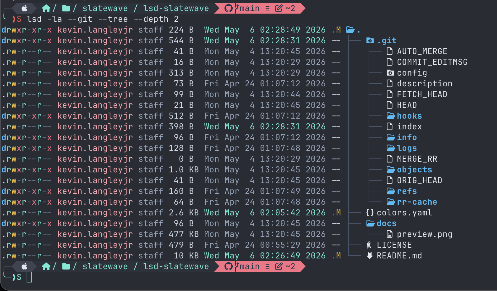

<div align="center">


<picture>
  <source media="(prefers-color-scheme: dark)" srcset="https://getslatewave.com/brand/wordmark-light.png">
  
</picture>

# Slatewave (LSD)

A Slatewave theme for [LSD](https://github.com/lsd-rs/lsd) — the next-gen `ls`, tinted slate and teal. Part of the [Slatewave family](#slatewave-family) — one palette across editors, terminals, prompts, notes, and more.

> _Slate below, teal above._



</div>

---

## What it styles

LSD splits its output into column *roles* — owner, permissions, size, date, git status, tree edges — and this theme recolors each of them to match the VSCode and Alacritty Slatewave ports. File-type colors (directories, symlinks, archives, media, …) are driven by `LS_COLORS`, so Slatewave composes with any `LS_COLORS` scheme you already run — [vivid](https://github.com/sharkdp/vivid), [trapd00r/LS_COLORS](https://github.com/trapd00r/LS_COLORS), or the default.

Two palette files ship: [`colors.yaml`](colors.yaml) uses `#rrggbb` hex (LSD ≥ 1.1) and [`colors-256.yaml`](colors-256.yaml) uses ANSI 256-color indices (LSD ≥ 1.0; required for 1.0.x, which silently ignores hex). Run `lsd --version` to pick — `1.0.x` → 256, `1.1+` → hex.

Highlights:

- **Permissions** — teal read, amber write, rose exec, slate for the `-` placeholder so the `rwx` column reads at a glance
- **Modified date** — teal-300 for the last hour, teal-200 for the last day, slate-400 for anything older; freshness is spatial, not verbal
- **Git status** — teal for stage/add, amber for modified, rose for deleted, bright red only for conflicted
- **Size** — slate for small files, amber for medium, amber-700 for large; large files visibly "weigh more"
- **Tree edges** — slate-600 so the guide lines recede and the filenames lead

---

## Requirements

- **LSD** ≥ 1.0 — [install guide](https://github.com/lsd-rs/lsd#installation). Hex colors (`colors.yaml`) need LSD ≥ 1.1; on 1.0.x use `colors-256.yaml`.  Check with `lsd --version`.
- A **Nerd Font** if you want the fancy icons — `icons.theme: fancy` in LSD's config. Tested with Hack Nerd Font and MesloLGS NF. Falls back to `icons.theme: unicode` cleanly.

---

## Installation

LSD looks for its config under `$XDG_CONFIG_HOME/lsd/` (typically `~/.config/lsd/`) on macOS and Linux, and `%APPDATA%\lsd\` on Windows.

### Which file?

| Your `lsd --version` | Use | Why |
|---|---|---|
| 1.1.0 or newer | `colors.yaml` (hex) | Truer color match against the rest of the Slatewave family. |
| 1.0.x | `colors-256.yaml` (256-index) | LSD 1.0.x silently ignores hex — the theme would fall back to defaults. |

Both files install to the same path (`~/.config/lsd/colors.yaml`); only the source differs.

### Clone + symlink

```sh
git clone https://github.com/kevinlangleyjr/lsd-slatewave.git \
  ~/.config/lsd-slatewave
mkdir -p ~/.config/lsd
# LSD ≥ 1.1
ln -sf ~/.config/lsd-slatewave/colors.yaml ~/.config/lsd/colors.yaml
# or, on LSD 1.0.x
ln -sf ~/.config/lsd-slatewave/colors-256.yaml ~/.config/lsd/colors.yaml
```

### Or: curl the file straight in

```sh
mkdir -p ~/.config/lsd
# LSD ≥ 1.1
curl -fsSL https://raw.githubusercontent.com/kevinlangleyjr/lsd-slatewave/main/colors.yaml \
  -o ~/.config/lsd/colors.yaml
# or, on LSD 1.0.x
curl -fsSL https://raw.githubusercontent.com/kevinlangleyjr/lsd-slatewave/main/colors-256.yaml \
  -o ~/.config/lsd/colors.yaml
```

### Activate the theme

The `colors.yaml` file is only consulted when LSD is told to use a custom theme. Add or edit `~/.config/lsd/config.yaml`:

```yaml
color:
  when: auto
  theme: custom
```

That's it — `lsd` picks up the new palette on the next invocation.

### Verify

```sh
lsd -la --git --tree --depth 2
```

You should see teal permissions, amber sizes, slate tree edges, and a git column that reads clearly against the rest of the row.

---

## Palette

Slatewave shares its palette with the companion themes. Every color resolves to a semantic role you can override in place.

### Foregrounds

| | Hex | Tailwind | Role |
|---|---|---|---|
|  | `#cbd5e1` | slate-300 | small file size, git default |
|  | `#94a3b8` | slate-400 | **group**, older dates |
|  | `#64748b` | slate-500 | no-access, non-file size, git unmodified, invalid inode |
|  | `#475569` | slate-600 | tree edges, git ignored |

### Accent — teal signature

| | Hex | Tailwind | Role |
|---|---|---|---|
|  | `#5eead4` | teal-300 | **read bit**, hour-old date, new-in-index |
|  | `#99f6e4` | teal-200 | day-old date, new-in-workdir |
|  | `#67e8f9` | cyan-300 | ACL flag |
|  | `#0e7490` | cyan-700 | octal permission suffix |

### State

| | Hex | Tailwind | Role |
|---|---|---|---|
|  | `#38bdf8` | sky-400 | SELinux context |
|  | `#7dd3fc` | sky-300 | valid hard-link count, git renamed |
|  | `#fda4af` | rose-300 | **user** (owner column) |
|  | `#fb7185` | rose-400 | **exec bit**, invalid links, git deleted |
|  | `#ef5350` | red-bright | git conflicted |
|  | `#b388ff` | — | exec-sticky bit, valid inode |
|  | `#fbbf24` | amber-400 | **write bit**, medium size, git modified |
|  | `#b45309` | amber-700 | large size, git typechange |

---

## Columns in detail

| Column | Role | Color |
|---|---|---|
| Permission — read | `permission.read` | teal-300 `#5eead4` |
| Permission — write | `permission.write` | amber-400 `#fbbf24` |
| Permission — exec | `permission.exec` | rose-400 `#fb7185` |
| Permission — exec-sticky | `permission.exec-sticky` | purple `#b388ff` |
| Permission — no-access | `permission.no-access` | slate-500 `#64748b` |
| Permission — octal suffix | `permission.octal` | cyan-700 `#0e7490` |
| Permission — ACL | `permission.acl` | cyan-300 `#67e8f9` |
| Permission — context | `permission.context` | sky-400 `#38bdf8` |
| Owner | `user` | slate-200 `#e2e8f0` |
| Group | `group` | slate-400 `#94a3b8` |
| Size — none | `size.none` | slate-500 `#64748b` |
| Size — small | `size.small` | slate-300 `#cbd5e1` |
| Size — medium | `size.medium` | amber-400 `#fbbf24` |
| Size — large | `size.large` | amber-700 `#b45309` |
| Date — hour old | `date.hour-old` | teal-300 `#5eead4` |
| Date — day old | `date.day-old` | teal-200 `#99f6e4` |
| Date — older | `date.older` | slate-400 `#94a3b8` |
| Inode — valid | `inode.valid` | purple `#b388ff` |
| Inode — invalid | `inode.invalid` | slate-500 `#64748b` |
| Links — valid | `links.valid` | sky-300 `#7dd3fc` |
| Links — invalid | `links.invalid` | rose-400 `#fb7185` |
| Tree edges | `tree-edge` | slate-600 `#475569` |
| Git — default | `git-status.default` | slate-300 `#cbd5e1` |
| Git — unmodified | `git-status.unmodified` | slate-500 `#64748b` |
| Git — ignored | `git-status.ignored` | slate-600 `#475569` |
| Git — new in index | `git-status.new-in-index` | teal-300 `#5eead4` |
| Git — new in workdir | `git-status.new-in-workdir` | teal-200 `#99f6e4` |
| Git — typechange | `git-status.typechange` | amber-700 `#b45309` |
| Git — deleted | `git-status.deleted` | rose-400 `#fb7185` |
| Git — renamed | `git-status.renamed` | sky-300 `#7dd3fc` |
| Git — modified | `git-status.modified` | amber-400 `#fbbf24` |
| Git — conflicted | `git-status.conflicted` | red-bright `#ef5350` |

---

## Customize

The theme file is plain YAML. Override in place, or drop a single key in your own `colors.yaml` and leave the rest untouched — LSD merges missing keys against its defaults.

```yaml
# Bump large-file warmth to orange
size:
  large: "#ff4500"

# Make the git-modified marker teal instead of amber
git-status:
  modified: "#5eead4"
```

### File-type colors (`LS_COLORS`)

LSD inherits directory, executable, archive, image, and symlink colors from `LS_COLORS`, not from this theme. A Slatewave-compatible `LS_COLORS` isn't shipped here (yet) — for now, pair with [vivid](https://github.com/sharkdp/vivid):

```sh
# A cool, slate-friendly baseline
export LS_COLORS="$(vivid generate molokai)"
```

or keep your existing `LS_COLORS`.

---

## Slatewave family

One palette. Every tool.

- **Editors** — [VSCode](https://github.com/kevinlangleyjr/vscode-slatewave) · [JetBrains](https://github.com/kevinlangleyjr/jetbrains-slatewave) · [Xcode](https://github.com/kevinlangleyjr/xcode-slatewave) · [Sublime Text](https://github.com/kevinlangleyjr/sublime-text-slatewave) · [Zed](https://github.com/kevinlangleyjr/zed-slatewave) · [Neovim](https://github.com/kevinlangleyjr/neovim-slatewave) · [Helix](https://github.com/kevinlangleyjr/helix-slatewave)
- **Terminals** — [Alacritty](https://github.com/kevinlangleyjr/alacritty-slatewave) · [Ghostty](https://github.com/kevinlangleyjr/ghostty-slatewave) · [iTerm2](https://github.com/kevinlangleyjr/iterm2-slatewave) · [WezTerm](https://github.com/kevinlangleyjr/wezterm-slatewave) · [Windows Terminal](https://github.com/kevinlangleyjr/windows-terminal-slatewave) · [Kitty](https://github.com/kevinlangleyjr/kitty-slatewave)
- **Prompts** — [Oh My Posh](https://github.com/kevinlangleyjr/slatewave-omp) · [Powerlevel10k](https://github.com/kevinlangleyjr/p10k-slatewave) · [Starship](https://github.com/kevinlangleyjr/starship-slatewave)
- **Multiplexer** — [tmux](https://github.com/kevinlangleyjr/tmux-slatewave)
- **CLI** — [bat](https://github.com/kevinlangleyjr/bat-slatewave) · [delta](https://github.com/kevinlangleyjr/delta-slatewave) · [btop](https://github.com/kevinlangleyjr/btop-slatewave)
- **Notes** — [Obsidian](https://github.com/kevinlangleyjr/obsidian-slatewave) · [Logseq](https://github.com/kevinlangleyjr/logseq-slatewave) · [MarkEdit](https://github.com/kevinlangleyjr/markedit-slatewave) · [Anytype](https://github.com/kevinlangleyjr/anytype-slatewave)
- **Launchers** — [Alfred](https://github.com/kevinlangleyjr/alfred-slatewave) · [Raycast](https://github.com/kevinlangleyjr/raycast-slatewave)
- **Chat** — [Slack](https://github.com/kevinlangleyjr/slack-slatewave)

See [getslatewave.com](https://getslatewave.com) for the full family.
---

## Contributing

Issues and PRs welcome. For palette changes, include a before/after screenshot of `lsd -la --git --tree` against a representative directory so the visual tradeoff is obvious.

---

## License

WTFPL — Do What The Fuck You Want To Public License. See [LICENSE](LICENSE).
